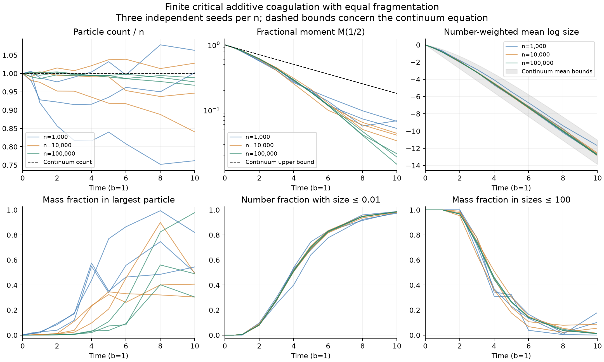

# A finite-particle experiment for critical additive kinetics

Date: 2026-09-06. Status: reproducible numerical illustration with independent implementation review. These experiments do not prove the continuum theorems or measure error against a computed continuum solution.

The simulator shows the expected separation between number and mass sampling: by time 10 almost all particles are small, while a few particles carry most material. At n=100,000 the three normalized counts remain within 3.3% of one at the final time, although the largest particle carries between 30% and 98% of the system's mass. The mass tail remains highly variable between realizations.



[PDF figure](../verification/critical_additive_particles.pdf) · [All 90 snapshots](../verification/critical_additive_particles.csv) · [Machine-readable summary](../verification/critical_additive_particles_summary.json)

## Experiment and exact sampling law

Each run starts from n unit masses, with n∈{1,000, 10,000, 100,000}. Parameters are λ=m=b=1. Every particle splits into equal halves at rate one; an unordered pair of masses x_i,x_j merges at rate (x_i+x_j)/n. The declared seeds are 11, 29, and 47 at each n. Snapshots are taken at times 0, 0.5, 1, 2, 3, 4, 5, 6, 8, and 10. All runs and seeds are retained.

With L current particles, the total event rate is 2L−1. Fragmentation occurs with probability L/(2L−1), followed by uniform parent selection. Otherwise the simulator first chooses a particle proportional to mass and then a different particle uniformly. The resulting unordered pair rate is

\[
 (L-1)\left[\frac{x_i}{n(L-1)}+\frac{x_j}{n(L-1)}\right]
 =\frac{x_i+x_j}{n}.
\]

A Fenwick tree supports the mass-weighted selection and updates in O(log L) time. A dense array permits constant-time uniform sampling and removal by moving the last particle. State and tree masses use C++ `long double`. Snapshot times do not restart the event clock.

The nine runs processed 6,588,932 events. Compilation, self-tests, and the fixed experiment took approximately three seconds on the recorded environment. This is an exact Gillespie event construction in real arithmetic, implemented with finite-precision masses, cumulative sums, and random draws.

## Results at time 10

Entries below give the minimum and maximum over the three seeds, not confidence intervals.

| Initial n | Count / n | Half moment | Mean log size | Largest mass fraction | Number fraction at size ≤0.01 |
|---:|---:|---:|---:|---:|---:|
| 1,000 | 0.762–1.063 | 0.0525–0.0688 | −12.800 to −11.696 | 0.500–0.820 | 0.974–0.987 |
| 10,000 | 0.8405–1.028 | 0.0339–0.0441 | −12.856 to −12.547 | 0.304–0.492 | 0.981–0.986 |
| 100,000 | 0.96772–0.98823 | 0.0148–0.0215 | −12.836 to −12.729 | 0.304–0.979 | 0.985–0.986 |

At n=100,000, only 1.05%–1.25% of material remains in particles of size at most 100. This contrasts with the roughly 98.5% of particles whose size is at most 0.01. The two percentages use different sampling weights and therefore are compatible.

The normalized half moment is n^-1Σ√x_i. Log means, log variances, and number CDFs divide by the actual particle count L. Mass CDFs and largest mass fraction divide by the conserved total mass n. The CSV also records event counts, minimum size, and several fixed and system-relative mass thresholds.

## Which theoretical comparisons are informative here

The exact finite count law has

\[
 E L_t=n+t,\qquad \operatorname{Var}L_t=(2n-1)t+t^2.
\]

One declared run, n=10,000 with seed 47, ends 3.59 exact standard deviations below its mean. It is retained. Three seeds are too few to estimate the count distribution reliably. An independent reviewer therefore ran an additional count check at n=50, t=10, seeds 0 through 1999: the final mean was 60.473 against the exact 60, and the sample variance was 1098.26 against 1090. The mean discrepancy is 0.64 theoretical standard errors. This supports the implementation without turning the small research ensemble into a statistical claim.

For the continuum equation, the [fractional-moment bound](invisible-kinetics-extension.md) is M_1/2(10)≤0.17983. The [log-size result](log-size-poisson-limit.md) places its mean log size between −13.86294 and −11.04298 at that time. All nine finite values happen to lie below the moment bound and within the log-mean interval. These continuum bounds do not apply pathwise to the finite simulation; agreement is descriptive evidence only.

The compound-Poisson reference variance is 2t(log 2)²=9.60906 at time 10. The observed log variances are larger, ranging from 11.96 to 14.57. This is preserved as a useful limitation of a direct finite-time Poisson comparison. The continuum theorem supplies a transport bound and a scaled distributional limit; it does not claim that these finite stochastic variances equal the reference variance, or that Wasserstein-1 convergence implies convergence of second moments.

The [logarithmic-time mass-CDF obstruction](finite-population-breakdown.md) is asymptotic and has a weak numerical certificate on this experiment's horizon. The coefficient boundaries log(n)/log 2 are approximately 9.97, 13.29, and 16.61. Optimizing the available fractional-moment lower bound at time 10 gives only 0.0000195 for n=1,000 and the trivial zero bound for the two larger n. The optimizer for n=1,000 is approximately p=0.998354. Thus these time-10 runs do **not** demonstrate a nearly maximal continuum discrepancy. No deterministic continuum solution was computed here, and the theorem's sufficient time scale is not a measured first breakdown time.

## Verification and reproduction

The built-in self-test checks weighted interval selection, capacity growth, moving the last particle on removal, pair rates, both count-generator moment identities, and mass conservation over 10,000 events. Each output snapshot checks the exact count identity L=n+births−deaths, mass conservation within 10^-10 relative tolerance, agreement between the tree and direct mass sum, and the physical size ceiling. All printed normalized masses equal one at 18 significant digits; this is a numerical observation, not exact-arithmetic certification.

The independent reviewer checked the algorithm, exercised 20,000 random array/tree operations under address and undefined-behavior sanitizers, and performed the count ensemble above. Review caught a minimum-size initialization bug in a configuration outside the fixed runs; it was corrected before final output. The [durable review](../reviews/critical-additive-simulator-review.md) records the checks and interpretation limits.

From the repository root, reproduce the data with

```bash
python3 research/verification/run_critical_additive_particles.py
```

This requires `g++` and Python's standard library. The executable is built in a temporary directory. Reproduce the PNG and PDF with

```bash
python3 research/verification/plot_critical_additive_particles.py
```

Plotting additionally requires Matplotlib. The [C++ source](../verification/critical_additive_particles.cpp), [runner](../verification/run_critical_additive_particles.py), and [plot script](../verification/plot_critical_additive_particles.py) are saved alongside the outputs. Compiler and platform details appear in the summary JSON. Reproduction on a different standard library or floating-point platform can alter paths despite the same seed.

The present experiment is deliberately small. A useful next computation would compare a controlled deterministic solver against the finite process in mass CDF, with a verified tail and discretization error; merely adding more finite trajectories would not supply that missing comparison.
