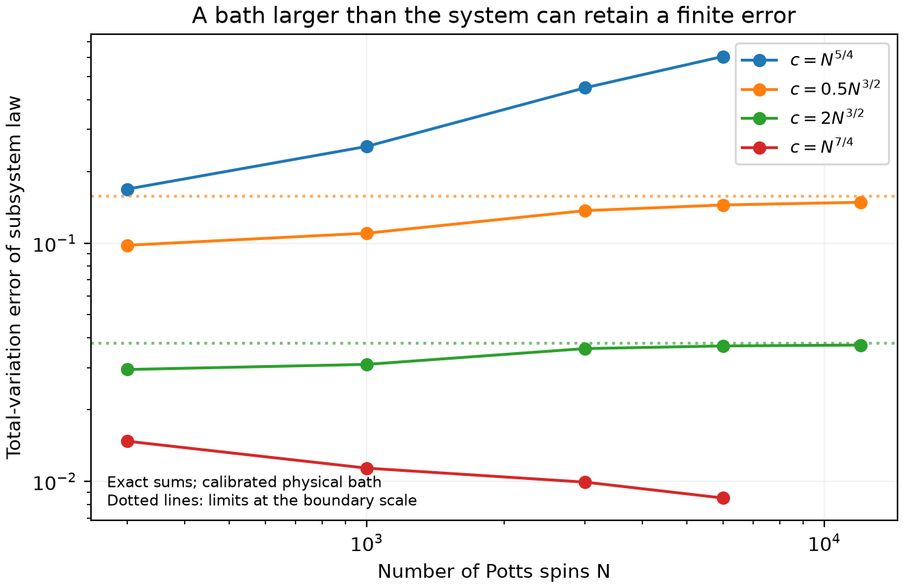

# Thermodynamics research notes

This repository records theoretical investigations relevant to molecular thermodynamics, finite systems, and nucleation. The exploratory research pass stopped at the user's request. Its existing reservoir developments are now assembled and further verified in [the LaTeX paper and reproduction bundle](paper-finite-reservoirs/README.md), with a [compiled PDF](paper-finite-reservoirs/main.pdf). The [results summary](research/results-summary.md) records the current claims and limitations; [the staged review record](paper-finite-reservoirs/WORKFLOW.md) distinguishes completed internal reviews from pending manuscript review. Correctness, independent review, and explicit prior-art boundaries take precedence over claims of novelty.

The pre-existing `literature/` directory contains a local, ignored literature knowledge base. New research notes below are separate from that collection.

| Investigation | Current conclusion | Evidence |
|---|---|---|
| [Physical finite reservoirs](paper-finite-reservoirs/README.md) | Sharp optimized two-phase N^(3/2) threshold, weak-support classification, and full boundary calibration. | Complete proofs and explicit positive-tail assumptions in [the paper](paper-finite-reservoirs/main.pdf); verified microscopic realizations include short-range Potts. |
| [Exact microscopic benchmark](research/potts-physical-bath.md) | The N^(3/2) threshold is proved for mean-field Potts spins, with optional quadratic kinetic degrees. Exact finite-N total-variation calculations reach 12,000 spins. | [Theorem review](research/verification/potts-microscopic-theorem-review.md), direct density integration and explicit spin enumeration. |
| [Energy-support classification](research/reservoir-support-classification.md) | If energy rescaled by b_N has a weak limit with at least three support points, optimal full-law convergence holds iff c≫b_N². No CLT, density, moment, or tail assumptions. | [Independent proof review](research/verification/three-support-bath-review.md). Strengthens the earlier three-phase theorem. |
| [Multiphase reservoir geometry](research/multiphase-reservoir-geometry.md) | Exact Gaussian classification distinguishes N, N^(3/2), and N² scales; the optimal retained-phase mass is now proved for arbitrary fields. Geometry itself is established prior work. | [Independent review](research/verification/multiphase-reservoir-review.md), exact quadrature and [prior-art audit](research/verification/multiphase-reservoir-prior-art.md). |
| [Finite reservoirs at coexistence](research/scouting-ensembles.md) | Exact two-Gaussian model has a sharp bath-size threshold for convergence of complete distributions, even after temperature adjustment. Superseded by the physical-bath theorem; one close historical prior-art source remains unavailable. | Independent derivation, numerical checks, and [1986–1990 prior-art audit](research/verification/ensemble-prior-art.md). |
| [Conditional transport capacity certificate](research/capacity-certificates.md) | Correct positive lower and projected upper bounds for a specified reversible diffusion. Conditional friction supplies the correction. Broad variational predecessors limit novelty. | [Independent mathematical review](research/verification/capacity-independent-review.md), network and diffusion checks. |
| [Finite-field nucleation response](research/scouting-nucleation.md) | Correct paired moment bounds and covariance bounds for capacity response; rate normalization and mobility assumptions matter. Standalone novelty not established. | [Independent review](research/verification/nucleation-independent-review.md), 2 independent network checks. |
| [Corrugated and twisting channels](research/channel-diffusion-bounds.md) | Useful connection between a familiar diffusion approximation and a rigorous bound. Planar inequality rediscovered: classical Ahlfors–Warschawski result. | Exact current construction, independent review, explicit prior-art match. |
| [Several droplets in a common reservoir](research/next-direction-scout.md) | Rank and depletion-angle criteria; internal composition relaxation can prevent stabilization. Much of the mechanism is established. | [Independent review](research/verification/droplet-reservoir-review.md); a concrete distinct-phase mixture example remains necessary. |
| [Stable fluctuations and unstable growth](research/stabilized-saddle-kinetics.md) | The core reconstruction is established. Finite-record bounds and sharp information limits are correct, with novelty unconfirmed. | [Independent review](research/verification/stabilized-saddle-review.md), 250 exact harmonic checks, and [prior-art audit](research/verification/stabilized-saddle-prior-art.md). |
| [Survival-conditioned thermodynamic integration](research/survival-conditioned-thermodynamics.md) | Endpoint force integration can depend on path; a spectral potential and a second-order error bound apply under fixed barrier conductances. Candidate novelty. | [Independent review](research/verification/survival-thermodynamics-review.md), exact counterexample, random-network and driven-protocol checks. |
| [Short-range Potts result and route](research/short-range-potts-route.md) | Plain large-q Potts spins in every fixed spatial dimension d>=2 have the sharp individual c≫N^(3/2) threshold. Positive contour moments and bond-to-spin transfer resolve sufficiency; two copies require c≫N² jointly. | [Current full contour proof](paper-finite-reservoirs/appendices/short-range-proof.tex) and two complete five-reviewer Stage 2 rounds; the linked route note preserves the earlier necessity-only development. |
| [Hamiltonian uncertainty at coexistence](research/broad-scout-1.md) | Matching phase probabilities can leave substantial within-phase error. Correct mixed-scale diagnostic; much of its geometry is established. | [Independent review](research/verification/learned-potential-geometry-review.md) and exact Gaussian example. |
| [Interfacial cost from bulk response](research/interfacial-inference-scout.md) | Exact response certificates and moment-matched tension ambiguity in a specified nonlocal double-parabola variational model. | [Independent proof review](research/verification/interfacial-inference-review.md) and [prior-art audit](research/verification/interfacial-inference-prior-art.md). No exact microscopic structure-factor claim. |
| [Two systems sharing a bath](research/shared-bath-phase-correlations.md) | A shared bath can preserve both balanced subsystem marginals while enforcing opposite phases and one bit of mutual information. Joint canonical accuracy requires a larger bath. | [Independent review](research/verification/shared-bath-review.md), physical-bath quadrature, and [prior-art audit](research/verification/shared-bath-prior-art.md). |

The physical reservoir-size thresholds and shared-bath results are the strongest current candidates: their proofs and microscopic realizations have independent support, while [novelty assessment](research/verification/physical-reservoir-novelty-audit.md) remains provisional. General quadratic bath-size sufficiency and opposite-phase locking have established precedents. The candidate distinction is sharp optimized necessity, the two-phase improvement, and full marginal accuracy with persistent joint error in an explicit bath-size regime. A failed search is not proof of novelty. Useful negative findings and derivations are retained so later work does not repeat them.

The [LaTeX manuscript](paper-finite-reservoirs/main.pdf) supersedes the earlier [Markdown draft](research/reservoir-coexistence-manuscript.md). It includes complete proofs, reproducible figures/data, and a [source-to-result coverage audit](paper-finite-reservoirs/COVERAGE.md). Internal mathematical reviews are not external peer review or a guarantee of historical priority.



## Reproducible checks

From this directory, run the relevant Python script:

```sh
python research/verify-ensemble-scaling.py
python research/code/check_reactive_susceptibility.py
python research/verification/check_nucleation_bounds.py
python research/verification/check_capacity_certificates.py
python research/verification/check_multiphase_reservoir.py
python research/verification/verify-physical-bath.py
python research/verification/check_potts_finite_bath.py
python research/verification/potts_finite_bath.py
python research/verification/check_droplet_schur.py
python research/verification/check_stabilized_saddle.py
python research/verification/check_survival_thermodynamics.py
python research/verification/check_survival_protocol.py
python research/verification/interfacial_inference_check.py
python research/verification/check_shared_bath_correlations.py
```

Scripts use NumPy/SciPy; the capacity script also uses Matplotlib. Each note states what its checks establish and what remains unproved. Finite-element output is numerical evidence, not a rigorous continuum enclosure.
