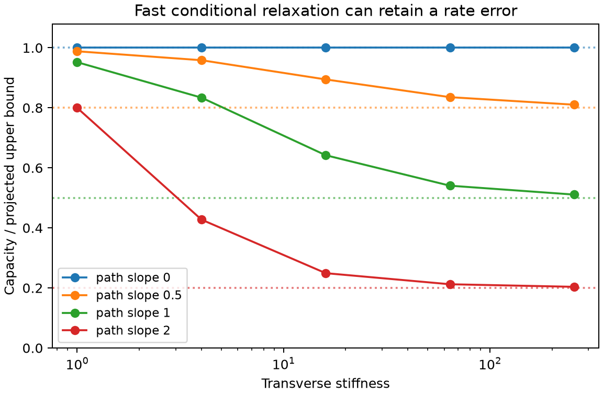

# Capacity bounds from conditional relaxation and transport

Status: verified synthesis, derived 2026-09-06 and consolidated 2026-09-07. Independent mathematical review confirms the Cartesian and general-coordinate bounds and Gaussian formulas. Standalone novelty is not established. The Dirichlet and Thomson principles, projected-capacity upper bound, and conditional effective dynamics are established tools. The proposed contribution is the explicit conditional transport lower bound and its use as a check on projected nucleation kinetics. No publication-ready novelty claim is made.

## Question and physical scope

Can equilibrium sampling along a nucleation coordinate, together with a specified reversible diffusion tensor, bound the error of the corresponding one-dimensional reactive flux without knowing the full committor? Equilibrium density alone cannot determine kinetics. This note fixes the microscopic dynamics and concerns capacity, not an arbitrary mean first-passage time.

Consider a transition strip `(a,b) × Y`, coordinate `x`, hidden coordinates `y`, positive weight

\[
w(x,y)=\rho(x)\nu_x(y),\qquad \int_Y\nu_x(y)\,dy=1,
\]

and reversible generator `L = w^{-1} div(w D grad)` with
`D = diag(d(x), M(x,y))`, `d>0`, and positive definite transverse matrix `M`.
The boundaries `x=a,b` carry committor values 0 and 1; lateral boundaries are reflecting, or `Y=R^m` with sufficient decay. Integrals and weak solutions below must exist. The weight can be unnormalized, provided the same normalization is used throughout.

Define

\[
\mathcal E(u)=\int w\{d u_x^2+\nabla_yu^TM\nabla_yu\}\,dx\,dy,
\quad C=\min_{u(a,\cdot)=0,u(b,\cdot)=1}\mathcal E(u).
\]

Capacity divided by an explicitly chosen basin mass is a capacity-based rate. It is not generally the exact reciprocal mean first-passage time from basin equilibrium. The frequency of stationary completed transitions uses normalized capacity; a rate per last-visited-state population has a different denominator.

## Theorem: a conditional transport resistance

Let `s_x(y)=partial_x log nu_x(y)`, which has conditional mean zero. Introduce the transverse operator

\[
K_x=-\nu_x^{-1}\nabla_y\cdot(\nu_xM\nabla_y),
\qquad K_x\phi_x=s_x,\quad \langle\phi_x\rangle_{\nu_x}=0,
\]

with reflecting conditions. Assume this equation has a finite-energy solution. Define

\[
g(x)=\langle s_x,K_x^{-1}s_x\rangle_{\nu_x}
=\langle\nabla_y\phi_x^TM\nabla_y\phi_x\rangle_{\nu_x}.
\]

Then

\[
\boxed{\left[\int_a^b\frac{d(x)^{-1}+g(x)}{\rho(x)}\,dx\right]^{-1}
\ \le C\le\ 
U:=\left[\int_a^b\frac{dx}{\rho(x)d(x)}\right]^{-1}.}
\tag{1}
\]

This is a finite-parameter inequality, with no fast-relaxation or high-barrier assumption. If the transverse Poincare gap has a proven lower bound `lambda(x)>0`, then

\[
g(x)\le \frac{\operatorname{Var}_{\nu_x}(s_x)}{\lambda(x)},
\tag{2}
\]

which gives a weaker explicit lower capacity bound by substitution. An empirically estimated gap is not automatically a certified lower bound.

### Proof

Restrict the Dirichlet problem to functions of `x`. Its minimizer `f` has
`f'=U/(rho d)` and energy `U`, proving the upper bound (established projected-capacity variational argument).

For the lower bound construct a **unit flux**, not a trial committor:

\[
J_x(x,y)=\nu_x(y),\qquad
J_y(x,y)=\nu_x(y)M(x,y)\nabla_y\phi_x(y).
\]

The Poisson equation implies
`div_y J_y=-nu_x s_x=-partial_x nu_x`, so `div J=0`. Its flux through each section is one and its lateral flux is zero. The Thomson resistance of this admissible current is

\[
\int\frac{J^TD^{-1}J}{w}
=\int_a^b\frac{d^{-1}+g}{\rho}\,dx.
\]

Thomson's principle states `1/C` is the minimum such resistance. This proves (1). The spectral bound (2) follows by the spectral theorem or the Poincare inequality and Cauchy–Schwarz. Signs can also be checked directly from the continuity equation above.

### Residual form and error budget

For the projected minimizer, `r=Lf=d f' s_x`, so `E[r|x]=0`. Write

\[
Q=\int_a^b\rho\langle r,K_x^{-1}r\rangle_{\nu_x}\,dx
=U^2\int_a^b\frac{g}{\rho}\,dx.
\]

The certificate becomes

\[
\frac{U^2}{U+Q}\le C\le U,
\quad 0\le\frac{U-C}{C}\le\frac Q U,
\quad \mathcal E(f-h)=U-C\le\frac{UQ}{U+Q}.
\tag{3}
\]

Here `h` is the unknown true committor. The last identity before the inequality is established Galerkin orthogonality. A direct residual/Poincare argument only gives `C >= U-Q`, which can be negative; the current construction keeps the lower bound positive when the resistance is finite.

## Interpretation: conditional transport and friction

`g(x)` is the least cost of moving the conditional distribution as `x` changes:

\[
g(x)=\min_{v:\ \partial_x\nu_x+\nabla_y\cdot(\nu_xv)=0}
\int\nu_x v^TM^{-1}v\,dy.
\tag{4}
\]

This follows by the weighted gradient/solenoidal orthogonal decomposition, with minimizer `v=M grad phi`. For constant isotropic `M`, this is the squared Wasserstein metric speed with the corresponding mobility factor. This metric interpretation is established optimal transport structure, not by itself a new discovery.

Equivalently, if `Y_t` evolves under the fixed-`x` stationary transverse dynamics,

\[
g(x)=\int_0^\infty\langle s_x(Y_0)s_x(Y_t)\rangle_{\nu_x}\,dt.
\tag{5}
\]

Thus the missing resistance is determined by relaxation of the conditional score, not the slowest mode alone. This is closely related to established thermodynamic friction/linear-response metrics. Estimating a truncated correlation integral does not give an upper bound without a controlled tail.

The resistance density `g/rho` identifies which coordinate slices contribute to the gap. Deep low-probability slices receive large weight. A globally small unweighted force residual is not enough for a useful relative rate bound.

## Analytic example: translating and changing Gaussian sections

For one transverse coordinate with constant diffusivity `D_y` and

\[
\nu_x(y)=\mathcal N(m(x),\sigma(x)^2),
\]

the optimal continuity velocity is
`v=m'+(sigma'/sigma)(y-m)`. Therefore

\[
g(x)=\frac{m'(x)^2+\sigma'(x)^2}{D_y}.
\tag{6}
\]

This follows directly from Gaussian integration and is also the familiar one-dimensional Gaussian Wasserstein metric. For `w=e^{-beta V(x)} N(m(x),1/(beta kappa))`, constant `d=D_x`, the width is independent of `x`, hence

\[
\left[\int_a^b e^{\beta V(x)}
\left(\frac1{D_x}+\frac{m'(x)^2}{D_y}\right)dx\right]^{-1}
\le C\le
\left[\int_a^b\frac{e^{\beta V(x)}}{D_x}\,dx\right]^{-1}.
\tag{7}
\]

The transverse gap is `beta kappa D_y`, but the certificate's relative width is independent of `kappa`. Increasing stiffness speeds conditional equilibration while increasing the score fluctuations by the same factor. Thus a large transverse gap alone is not a sufficient argument for accurate kinetics along the coordinate.

The failure of the stiff-coordinate projection is already explicit in Legoll–Lelievre (2009), sections 4–5. It is a useful illustration here, **not a new discovery**.

### Sharpness as the Gaussian width vanishes

The independent reviewer supplied the following direct variational proof. Let `sigma` be constant, tend to zero, and let `rho,d,m` be smooth with positive bounded `rho,d` on the finite interval. Set

\[
d_{\rm eff}(x)=\frac{d(x)D_y}{D_y+d(x)m'(x)^2},\qquad
L=\left[\int_a^b\frac{dx}{\rho d_{\rm eff}}\right]^{-1}.
\]

Let `F'=L/(rho d_eff)` and define `alpha*=d m' F'/(D_y+d m'^2)`. Choose a smooth endpoint cutoff of width `delta` and write the cut-off function as `alpha_delta`. The admissible trial function

\[
u(x,y)=F(x)+\alpha_\delta(x)[y-m(x)]
\]

has exactly the energy excess

\[
\mathcal E(u)-L
=\int_a^b\rho\left[(D_y+d m'^2)(\alpha_\delta-\alpha_*)^2
+d\sigma^2(\alpha_\delta')^2\right]dx.
\]

The first term is `O(delta)`, and the second is `O(sigma^2/delta+sigma^2)` for bounded derivatives. Taking `delta=sigma` proves
`L <= C_sigma <= L+O(sigma)`. If `alpha*` already vanishes at both endpoints, no cutoff is needed and the upper error is `O(sigma^2)`. Trial functions need not be between 0 and 1; clipping would only lower their energy. This proves asymptotic sharpness of the certificate. The geometric effective-diffusivity mechanism is established in the curved-channel literature.

### Numerical checks

`verification/check_capacity_certificates.py` checks a discrete flow-repair counterpart on 120 randomly weighted reversible networks and solves a two-dimensional Gaussian-strip diffusion problem. All network inequalities passed. The lower certificate can be loose: the smallest lower/exact ratio in this deliberately broad network set was about 0.0082.

For a linear pathway of slope 2 and stiffness 256, finite-element estimates of `C/U` were 0.20669, 0.20372, and 0.20291 under mesh refinement; the analytic lower bound is 0.2. The predicted stiff-limit rate error is therefore approached. The zero-slope control gave `C/U=1.000265` on the medium mesh instead of exactly 1, revealing its discretization/quadrature error. These numerical estimates are not rigorous continuum enclosures. Transverse truncation uses reflecting boundaries at six Gaussian standard deviations in the sheared strip.

## Verified general-coordinate extension

The [independent review](verification/capacity-independent-review.md), section 5, proves the extension for a smooth scalar coordinate \(\xi\) with nonvanishing gradient, a positive definite diffusion tensor \(D\), and complete absorbing fibers. Write \(n=\nabla\xi\). The correct tangent mobility is

\[
 B=D-Dn(n^TDn)^{-1}n^TD,
\]

and the conditional measure on a fiber is proportional to \(w/|n|\), with surface measure. It is generally incorrect to use the Euclidean tangent projection of \(D\) or the Cartesian score formula unchanged.

For the projected minimizer \(f\), let \(r=L(f\circ\xi)\), and solve the conditional fiber Poisson equation \(K_x\phi_x=r\). If its integrated energy \(Q=\int\rho(x)\langle r,K_x^{-1}r\rangle\,dx\) is finite, the tangent correction produces a unit divergence-free current of resistance \(1/U+Q/U^2\). Thus \(U^2/(U+Q)\le C\le U\) also holds in this geometry.

Solvability requires zero residual mean on each connected fiber component, not merely on the whole fiber. Compatible reflecting walls require zero baseline normal current and zero correction flux; otherwise an inhomogeneous boundary correction is necessary. The review gives the exact operators, boundary conditions, and counterexamples to omitting these assumptions. Vanishing coordinate gradients are outside this statement.

## Prior art checked and novelty boundaries

- Zhang, Hartmann and Schuette, *Effective dynamics along given reaction coordinates, and reaction rate theory* (2016), DOI [10.1039/C6FD00147E](https://doi.org/10.1039/C6FD00147E), [open author manuscript](https://publications.imp.fu-berlin.de/1974/1/201606_ZIB_16-35_report_Zhang_Hartmann_Schuette.pdf). Proposition 6 in section 3.3.3 gives the upper bound and exact energy error identity. These are **not new here**. The manuscript is saved under `research/sources/`.
- Legoll and Lelievre, *Effective dynamics using conditional expectations*, [arXiv:0906.4865](https://arxiv.org/abs/0906.4865): conditional equilibration and coarse-graining error are established; sections 4–5 already show stiff-limit projection failure. Independent prior-art review retrieved and inspected the open paper.
- Lelievre and Zhang, *Pathwise estimates for effective dynamics: the case of nonlinear vectorial reaction coordinates*, [arXiv:1805.01928](https://arxiv.org/abs/1805.01928): nonlinear geometry and conditional Poincare controls are established. A detailed theorem comparison was not completed, so this source remains a limitation on any novelty claim.
- Petersen, Lichtinger and Covino (2026 preprint), [arXiv:2608.02536](https://arxiv.org/abs/2608.02536), local package `literature/papers/petersen2026-committors-and-reaction-rates-from/`. Pages 2–4 state a flux-fidelity variational bound and energy identity; the empirical fidelity and flux plateau require approximation. Their exact energy identity is not an independent lower capacity certificate. This note instead requires exact admissible boundaries and a specified transverse model.
- Bradley (2009), *Diffusion in a two-dimensional channel with curved midline and varying width*, [DOI](https://doi.org/10.1103/PhysRevE.80.061142): the open full primary article was inspected in the independent review. Its curved-midline and width corrections establish the geometric diffusivity mechanism; this comparison does not resolve priority of the finite-parameter certificate.
- Equilibrated flux reconstruction and primal/dual energy bounds are long-established numerical analysis techniques. The lower-bound proof is an application of that structure. A novelty claim must isolate the conditional transport/friction certificate and establish that it has not already appeared in this form.
- Zhong and DeWeese (2024), [arXiv:2404.01286](https://arxiv.org/abs/2404.01286), establish the continuous thermodynamic-friction/Wasserstein connection. Sawchuk and Sivak (2026 preprint), [arXiv:2601.01273](https://arxiv.org/abs/2601.01273), address related graph resistance geometry. These metric connections are prior art, not claims of novelty here.

## Final disposition

Independent proof review, reversible-network stress tests, diffusion calculations, and a bounded prior-art audit are complete. The result is retained as a useful conditional-current certificate and synthesis of established variational tools. No standalone publication claim is made. A theorem-level priority comparison beyond the sources examined and a distinct physical application would be needed to justify that stronger claim; they are not part of the completed research pass.
