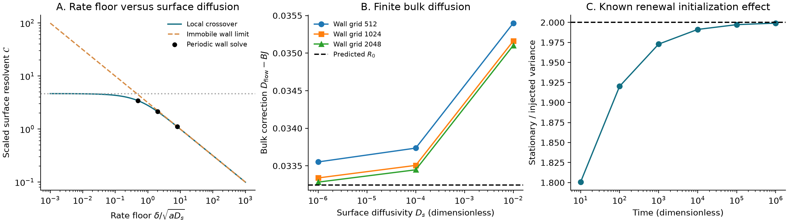
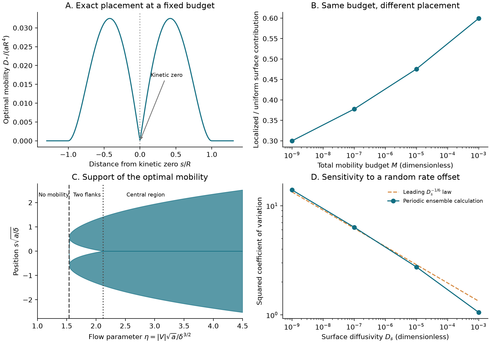

# Kinetic defects in adsorbing channels: singular dispersion, mobility placement, and the value of locating slow exchange

**Working-paper draft — 2026-09-07. Internal research document; not submitted or published.**

A [companion working paper](working-paper-uncertain-mobility.md) develops the completed positive-moment, generic-fold, measurement-resolution and optimal-value transfer results.

The mathematical statements below have independent review in the linked repository records. Their novelty is a separate, unfinished assessment. This draft organizes a possible paper around the transport and design results; general-power degeneracies and detailed transient formulas are left to supporting material. Both the disorder moments and the leading information-dependent design values now have proved finite-bulk transfers; the latter does not identify exact finite-budget optimizing profiles.

## Abstract

Equilibrium adsorption does not determine the dispersion of a solute whose exchange with a channel wall varies spatially. We study reversible adsorption with a constant adsorption-to-desorption ratio and nearly inactive exchange points. Mean retention and tracer speed remain fixed, while weak lateral surface diffusion controls a singular contribution to axial spreading. An exact variational elimination of the wall field separates this contribution from finite transverse bulk mixing. For isolated quadratic rate minima, the surface term has a quarter-power divergence and an explicit crossover with the minimum exchange rate; the remaining bulk contribution approaches a finite limit. Optimizing a fixed integral of surface diffusivity changes the divergence from a quarter power to a fifth power and gives an explicit localized mobility profile. A finite rate floor produces an exactly solvable placement transition. In a bounded random-offset ensemble, rare mergers of kinetic zeros control high disorder moments. Choosing mobility after observing the defect locations changes the optimal expected budget exponent, whereas the best predetermined design changes only its coefficient. Both the moment laws and leading optimal design values transfer to fixed positive bulk diffusivity. These results use established dispersion, oscillator and optimal-conductivity methods; their prospective contribution is the coupled transport asymptotic and its quantitative design consequences.

## 1. A transport question that equilibrium measurements cannot answer

Two walls can have the same equilibrium adsorption and mean tracer speed but markedly different axial band broadening. In the model considered here, adsorption and desorption share a spatially varying rate factor. Their ratio is constant, so the equilibrium populations do not reveal a region where both processes are slow. A particle that enters such a region may remain adsorbed for a long time. Lateral motion on the wall provides an additional escape route, even when that motion is weak on the scale of the channel perimeter.

This separation between equilibrium and kinetics is established physical reasoning. Surface adsorption, diffusion and convection already appear in [Dill and Brenner's generalized Taylor-dispersion theory](https://doi.org/10.1016/0021-9797(82)90239-9). [Levesque et al.](https://arxiv.org/abs/1211.5224) derive stochastic dispersion formulas with adsorption and desorption in steady and oscillatory channel flows. At zero lateral mobility, our well-mixed reduction is a continuous multirate exchange model of the kind developed by [Haggerty and Gorelick](https://doi.org/10.1029/95WR10583). Neither kinetic broadening nor broad residence-time distributions are new mechanisms here.

The question is more specific: how does a spatially resolved kinetic minimum set the singular response, and how should limited surface mobility be distributed to reduce it? Answering it requires more than assigning a distribution of waiting times. Surface diffusion connects nearby adsorbed states, so their spatial arrangement matters. It also requires separating a local surface calculation from the coupled bulk problem. Finally, an optimal design for a measured defect may be inappropriate when the defect location is unknown.

We address these questions in a single reversible model. The principal deterministic results are a finite-bulk reduction, a local crossover theorem, and an explicit optimal-placement law. A controlled random ensemble then exposes the consequences of near-merging defects. The final design theorem makes the value of observing the pattern quantitative, including its leading finite-bulk transport consequence. A separate paper on uncertain surfaces remains an editorial option, but the mathematical connection now extends beyond the well-mixed reduction.

## 2. Model, invariant measure and the dispersion observable

Let x denote the longitudinal coordinate and y a point in a fixed bounded connected smooth cross-section Ω. Its area is A and its adsorbing boundary Γ has perimeter P and arclength s. The imposed longitudinal bulk velocity u belongs to L²(Ω) and is independent of x. Let c(x,y,t) and ρ(x,s,t) be bulk and adsorbed concentrations. With outward bulk normal n, a conservative dilute model is

\[
 \partial_t c+u(y)\partial_xc
 =D_b\Delta_yc+D_b^x\partial_x^2c,
 \qquad
 -D_b\partial_nc=Kk(s)c-k(s)\rho,
 \tag{1}
\]

\[
 \partial_t\rho
 =\partial_s[D(s)\partial_s\rho]+D^x(s)\partial_x^2\rho
 +Kk(s)c|_\Gamma-k(s)\rho.
 \tag{2}
\]

Here D_b>0 is fixed transverse bulk diffusivity, k is a desorption rate, and Kk is the adsorption coefficient. The affinity K has dimensions length. Surface advection is absent. The divergence-form surface diffusion in (2) preserves a uniform surface equilibrium even when D varies. Isotropic surface motion means D^x(s)=D(s); it is an additional assumption used in the joint cost optimization.

The transverse invariant measures are dy/Z in the bulk and Kds/Z on the wall, where

\[
 Z=A+KP,\qquad V=Z^{-1}\int_\Omega u(y)dy.
 \tag{3}
\]

Thus equilibrium surface occupancy KP/Z and mean speed V are independent of k and D. An exact rate zero is an idealization. Most practical consequences below have a positive minimum-rate version. Initial atoms placed exactly at absorbing degenerate points are excluded from statements based on the absolutely continuous invariant measure.

We define D_flow as the flow-induced part of the long-time axial diffusivity, with Var X(t)∼2D_eff t. Independent axial Brownian motion adds

\[
 D_{\rm mol}=\frac{AD_b^x+K\int_\Gamma D^x(s)ds}{Z},
 \qquad D_{\rm eff}=D_{\rm mol}+D_{\rm flow}.
 \tag{4}
\]

The static coefficient is the centered-velocity Poisson quadratic form of the reversible transverse process. Its variational formulation is convenient for both singular coefficients and design. The assumptions describe a dilute, longitudinally uniform linear transport model; they do not include adsorption saturation, moving interfaces, concentration-dependent affinity or hydrodynamic feedback.

## 3. Exact separation of surface kinetics and bulk mixing

Define the surface operator and source response

\[
 H_D=-\partial_s[D(s)\partial_s]+k(s),\qquad
 J(D)=\langle1,H_D^{-1}1\rangle_\Gamma,
 \qquad B=KV^2/Z.
 \tag{5}
\]

For degenerate coefficients, J is defined by the supremum of 2∫h−∫[D|h′|²+kh²] over smooth periodic tests, allowing an infinite value. This avoids assigning an unspecified diffusion process to every admissible coefficient. In the exactly well-mixed bulk model, D_flow=BJ. The following identity provides the finite-bulk connection.

**Theorem 1: exact reduction and a regular bulk remainder.** Use a specified closed energy form for which the surface source response and the coupled cell response are finite, and let q=H_D^{-1}1 in that energy sense. This includes positive constant surface diffusivity and the explicit finite-response trial designs used below. Then

\[
 D_{\rm flow}=BJ(D)+R(D),\qquad R(D)\ge0,
 \tag{6}
\]

where

\[
 ZR(D)=\sup_{\int_\Omega f=0}
 \left[2L_D(f)-D_b\int_\Omega|\nabla f|^2-KQ_D(f_\Gamma)\right],
 \tag{7}
\]

\[
 L_D(f)=\int_\Omega(u-V)f-KV\int_\Gamma kqf_\Gamma,
 \quad
 Q_D(v)=\inf_h\int_\Gamma[D|h'|^2+k(h-v)^2]\ge0.
\]

For constant D=d>0 and k=δ+k₀, suppose k₀ is fixed, nonnegative and C², with finitely many nondegenerate quadratic zeros and positive elsewhere. Uniformly in δ≥0 as d→0,

\[
 R(d,\delta)\longrightarrow
 R_0=\frac{D_b}{Z}\int_\Omega|\nabla f_0|^2,
 \tag{8}
\]

where −D_bΔf₀=u−V and D_b∂ₙf₀=−KV, with zero bulk mean. The limit is independent of the heterogeneous rate profile.

**Proof roadmap.** The full dissipation is D_b∫|∇f|²+K∫[D|h′|²+k(h−fΓ)²]. Maximizing its forced quadratic functional over h gives (6)–(7) exactly. Integration of H_Dq=1 gives ∫kq=P, which makes the bulk load invariant under adding constants. For quadratic minima, localization supplies λ_min(H_d)≥δ+c√d. Multiplication of H_dq=1 by kq gives

\[
 \|kq\|_2^2+d\int k|q'|^2
 =P+\frac d2\int k_0''q^2.
\]

Together with J=O(d^{-1/4}), this implies kq→1 in L². Trace and Poincaré bounds control (7); testing its limit with smooth bulk fields gives (8). The proof is recorded in [the independent bulk review](review-singular-exchange.md). It is not uniform as D_b vanishes.

The distinction between exact and asymptotic elimination matters. Equation (6) contains the exact J. Replacing J by a local leading approximation introduces its own error, which need not be bounded even though R converges. The smooth-test variational lower bounds remain available for arbitrary admissible designs, but (6) is not an unrestricted subtraction of infinite forms. For example, zero mobility at a quadratic rate zero has J=∞ and lies outside this finite-response identity; one must not evaluate BJ as 0·∞ when V=0.

## 4. A quadratic defect and its diffusion cutoff

Suppose k₀(s_j+r)=a_jr²+o(r²), a_j>0. The local surface length is ℓ_j=(d/a_j)^{1/4}, and the exchange-diffusion rate is λ_j=√(a_jd). These follow by balancing d/ℓ² with a_jℓ².

**Theorem 2: the finite-rate-floor crossover.** As d→0, uniformly for bounded δ/√d,

\[
 J(d,\delta)=d^{-1/4}\sum_j a_j^{-3/4}
 \mathcal C\!\left(\frac{\delta}{\sqrt{a_jd}}\right)
 +o(d^{-1/4}),
 \tag{9}
\]

\[
 \mathcal C(z)=\frac\pi2
 \frac{\Gamma((z+1)/4)}{\Gamma((z+3)/4)},\qquad
 \mathcal C(0)=4.6474760094\ldots.
 \tag{10}
\]

Equations (6)–(10) establish the same leading singular coefficient at every fixed positive bulk diffusivity. For V=0 this contribution vanishes; slow equilibration alone does not guarantee that a chosen velocity observable detects the defect. More general velocity-matching cancellations are treated in [the observability note](kinetic-trap-observability.md).

The coefficient is an established oscillator calculation. Rescaling near a minimum gives −∂²+y²+z. The double-integrated Mehler kernel is √(2π/sinh 2t); its Laplace integral gives (10). Quadratic killing and its kernel are explicitly treated by [Mazzolo and Monthus](https://arxiv.org/abs/2204.05607). The contribution here is its controlled role in the coupled transport problem. Dirichlet–Neumann bracketing, uniform energy-tail bounds and potential comparison prove localization for arbitrary fixed C² profiles satisfying the hypotheses; see [the independent localization proof](review-localization.md).

For large z, C(z)∼π/√z, recovering the reciprocal-rate integral near a small positive floor. This matching requires δ→0 as well. If δ stays positive, the entire wall profile determines the finite limiting J. The crossover occurs at δ∼√(a_jd), not at a rate estimated from diffusion across the whole perimeter. The static theorem also does not interchange the long-time limit with d→0.

**Figure 1.** The local rate-floor crossover, convergence of the finite-bulk remainder, and a separate initialization check. Panel C concerns established renewal behavior: the stationary and freshly injected anomalous variances differ by a factor approaching two. That ratio is not claimed as new; it agrees with [Akimoto, Cherstvy and Metzler](https://arxiv.org/abs/1803.07232). [Exportable PDF](../results/surface-exchange-verification.pdf).

## 5. Spatial placement changes the budget law

Consider a fixed mobility budget M=∫ΓD. With isotropic surface diffusion, all placements with this budget have the same axial Brownian cost KM/Z. The design question is therefore where to place mobility to reduce flow broadening. A finite perimeter is essential when comparing to uniform D=M/P; no positive uniform coefficient has finite total mass on the whole line.

**Theorem 3: exact local placement and compact-wall asymptotics.** For the local problem k(s)=as² on the real line, the unique optimal nonnegative L¹ coefficient of mass M is

\[
 R=\left(\frac{80M}{3a}\right)^{1/5},\quad y=|s|/R,\qquad
 D_*(s)=\frac{aR^4}{8}y(1-y)^2(1+2y)\mathbf1_{y<1},
 \tag{11}
\]

and

\[
 J(D_*)=\frac{12}{aR}
 =C_*a^{-4/5}M^{-1/5},\qquad C_*=12(3/80)^{1/5}.
 \tag{12}
\]

For a compact wall with separated quadratic zeros, this becomes

\[
 \inf_{\int D=M}J(D)\sim
 C_*\left(\sum_j a_j^{-2/3}\right)^{6/5}M^{-1/5},
 \tag{13}
\]

with leading allocation M_j/M=a_j^{-2/3}/∑_ia_i^{-2/3}. The corresponding leading full-bulk optimum is B times (13) when V≠0. This is a theorem about optimal values, not exact finite-budget support topology in a general channel.

The proof uses a global certificate. The local inverse field is (9−8y)/(aR²) inside the support and 1/(as²) outside. Its slope has a constant maximum precisely where mobility is placed. Testing every competing coefficient with this field proves the lower bound, while its zero-flux equation attains it. Localization transfers the bound to a compact wall. Explicit trial designs have bounded kH_D^{-1}1, so their finite-bulk correction remains lower order. These steps are independently checked in [the placement theorem](optimal-mobility-placement.md) and [its localization review](review-optimal-placement-localization.md).

This is an application of established optimal-conductivity reasoning. [Bouchitté and Buttazzo](https://ems.press/journals/jems/articles/123) develop optimal mass distributions through transport equations; [Buttazzo, Oudet and Velichkov](https://arxiv.org/abs/1506.00141) give the saturated-gradient reinforcement dual. A related engineering precedent is [Alexandersen and Sigmund's cooling-fin optimization](https://doi.org/10.1109/ITherm51669.2021.9503196). The specific profile, transport localization and change from M^{-1/4} to M^{-1/5} are the prospective additions.

A positive rate floor makes the placement problem more informative than a simple rescaling. Optimizing both placement and total mass for k=δ+as² reduces to a weighted Lipschitz projection with parameter η=|V|√a/δ^{3/2}. No mobility is optimal for η≤η_c=8/(3√3). Above this threshold, two patches activate on the flanks of the minimum. Their closures meet at η=3/√2; the optimum still vanishes at the center itself. The mobility mass grows as (η−η_c)^{5/2}, while the improvement over zero mobility grows as (η−η_c)^{7/2}. Thus initial activation gives a particularly small benefit. Exact quartic profiles, costs and certificates are in [the phase-diagram theorem](placement-phase-diagram.md).

At zero floor, joint optimization gives min_D[∫D+V²J]=(36/5)a^{-2/3}|V|^{5/3} in the local quadratic problem. On a compact channel it is a weak-flow asymptotic, requiring the entire imposed velocity field to decrease proportionally. Uniform mobility instead gives an optimized excess of order |V|^{8/5}. These exponents compare specified design classes; they do not establish manufacturability or throughput-optimal operation.

## 6. Rare merging defects control high disorder moments

Fixed-realization asymptotics cannot simply be averaged. To make that issue testable, nondimensionalize the wall to length 2π and choose the explicit bounded ensemble

\[
 k_c(s)=(c+\cos s)^2,\qquad c\sim\mathrm{Uniform}[-2,2].
 \tag{14}
\]

All samples have the same equilibrium adsorption. For |c|<1 the underlying field c+cos s has two simple zeros, giving quadratic zeros of k_c. Their quadratic coefficients vanish as |c| approaches one. At c=±1 the rate zeros merge into a quartic zero. Samples outside that range have no zero. The family avoids a collapse of the entire rate amplitude.

**Theorem 4: disorder-moment transition, including finite bulk diffusion.** For constant surface diffusivity d→0, let J_d(c)=⟨1,(−d∂²+k_c)^{-1}1⟩. Its moments have positive explicit leading constants and scales

\[
 \mathbb E J_d^q\asymp
 \begin{cases}
 d^{-q/4},&0<q<4/3,\\
 d^{-1/3}\log(1/d),&q=4/3,\\
 d^{1/3-q/2},&q>4/3.
 \end{cases}
 \tag{15}
\]

More precisely, E J_d∼C₀²d^{-1/4}/√π, where C₀=C(0), and

\[
 \operatorname{Var}J_d\sim
 2^{2/3}d^{-2/3}\int_\mathbb R\mathcal Q(\mu)^2d\mu,
 \quad
 \mathcal Q(\mu)=\langle1,[-\partial_y^2+(y^2-\mu)^2]^{-1}1\rangle.
 \tag{16}
\]

The squared coefficient of variation grows as d^{-1/6}. These are fluctuations between wall realizations, not displacement moments of a particle. For V≠0, every leading qth moment of full flow dispersion equals B^q times the corresponding scalar moment.

Near a merger, the offset layer has width O(d^{1/3}) and response O(d^{-1/2}). Outside it, separate quadratic defects give a coefficient proportional to (1−c²)^{-3/4}. Matching these regimes produces the threshold and logarithm. Uniform envelopes, rather than this scaling argument alone, justify the moment limits. The finite-bulk transfer is now proved: the special identity for k_c″ yields

\[
 \sup_{|c|\le2}\|k_cH_{d,c}^{-1}1-1\|_2=O(d^{1/12}),
 \qquad D_{\rm flow}(d,c)=BJ_d(c)+R_0+o(1)
 \tag{17}
\]

uniformly in c. See [the scalar review](review-random-kinetic-barriers.md) and [the finite-bulk review](review-random-finite-bulk.md).

Rare degeneracies dominating different moments is an established organizing idea, including [Berry, Keating and Schomerus's bifurcation analysis](https://doi.org/10.1098/rspa.2000.0580). Squared random potentials and H^{-1}1 also have precedents in [Kirsch and Raikov](https://arxiv.org/abs/1704.01435) and [localization-landscape theory](https://arxiv.org/abs/1711.04888). Our result concerns this positive source response, compact ensemble and transport prefactor. It is not a universal theorem for Gaussian disorder. Indeed, g=A cos s+B sin s with independent Gaussian A,B gives finite mean limiting zero marks but E J_d=∞ for every d>0 because of rare global amplitude collapse. That counterexample is retained in [the disorder note](random-kinetic-barriers.md).

## 7. Observing the pattern changes the optimal expected exponent

The same ensemble distinguishes two decisions. A predetermined design must use one deterministic D for all offsets. An adaptive design may use c, and therefore the defect locations, before choosing D. For the scalar surface functional define

\[
 \Phi(M)=\inf_{\int D=M}\mathbb E_cJ_c(D),\qquad
 \Psi(M)=\mathbb E_c\inf_{\int D=M}J_c(D).
 \tag{18}
\]

**Theorem 5: information-dependent design and its finite-bulk transfer.** The scalar values in (18) satisfy, as M→0,

\[
 \Phi(M)\sim C_0Z_w^{5/4}M^{-1/4},\qquad
 Z_w=4^{-4/5}\,2\mathrm B(3/10,1/2),
 \tag{19}
\]

\[
 \Psi(M)\sim
 \frac{C_*2^{6/5}}4\mathrm B(1/2,1/5)M^{-1/5}.
 \tag{20}
\]

An asymptotically optimal predetermined shape for the scalar problem is

\[
 D_M(s)=\frac{M|\sin s|^{-2/5}}{2\mathrm B(3/10,1/2)}.
 \tag{21}
\]

Its singularities are integrable and belong to the stated unrestricted L¹ budget class. Bounded smooth approximations can attain the same asymptotic infimum without a common fixed mobility cap.

For fixed smooth shapes, changing from offset to root position gives the weighted objective C₀M^{-1/4}∫w(s)d(s)^{-1/4}ds, with w=|sin s|^{-1/2}/4. Hölder's inequality selects (21), but does not by itself prove optimality over budget-dependent microstructure. The sharp lower bound averages localized dual tests over defect positions and controls their squared-gradient density uniformly over the entire wall. It therefore covers increasingly narrow spikes and arbitrarily rapid oscillations in the competing design. For the adaptive problem, uniform trial bounds near mergers justify averaging the samplewise optimal-placement law. These points are independently reviewed in [the design-under-information proof](review-robust-mobility-design.md).

In the dimensionless ensemble, uniform predetermined mobility has mean coefficient 19.2932, optimal predetermined mobility 18.3861, and adaptive placement 22.4046 with the different exponent in (20). Predetermined optimization improves the leading constant by about 4.7%. Observing the pattern changes the exponent: Ψ/Φ∼1.21857M^{1/20}→0. The power is small, so this is not evidence of a large gain at a specified finite experimental budget.

For the full bulk–surface model, define the counterparts of (18) using D_flow(D,c) in place of J_c(D). At fixed positive D_b and fixed V≠0, their leading values are B times (19) and (20), respectively. The [finite-bulk design review](review-robust-finite-bulk.md) proves the required upper bounds using specific trial families; nonnegativity of the bulk remainder gives the lower bounds. For predetermined design, first fix a smooth positive truncation of (21), take M→0, and then remove the truncation. For adaptive design, separated-root patches and a distinct merging-root patch have uniformly bounded exchange product k_cH_D^{-1}1. Sharp constants follow by ordered localization limits. This does not prove a bulk remainder estimate for the unbounded shape (21) itself or identify the full finite-budget optimizers.

[Expected-compliance optimization](https://researchportal.bath.ac.uk/en/publications/robust-topology-optimization-minimization-of-expected-and-variance/) is an established decision framework. The proposed addition is the sharp singular expected optimum and its information-dependent exponent, not the distinction between designing before and after observing uncertainty.

**Figure 2.** Explicit budgeted placement, compact-wall comparison with uniform mobility, the finite-floor support diagram, and disorder sensitivity. In panel C the two closures meet while mobility remains zero at the center point. Panel D concerns the constant-mobility random ensemble of Theorem 4, not a numerical verification of Theorem 5. [Exportable PDF](../results/mobility-design-and-disorder.pdf).

## 8. Verification, interpretation and a publication path

The proofs were checked independently, and numerical tests use several routes. Periodic surface finite differences recover the oscillator crossover with grid refinement. A detailed-balance finite-volume bulk solver, including a half-cell Robin correction, recovers the positive regular remainder. At d=10^{-6}, its finest-grid remainder is 0.0332828 against a limiting value 0.0332451 in the chosen strip benchmark. Independent primal optimization started from zero mobility recovers the separated and meeting-patch profiles; a separate constrained dual calculation checks their inverse fields. Reproduction commands and limitations are collected in [numerical verification](numerical-verification.md), with programs under [scripts](../scripts).

Disorder tests require particular care. At d=10^{-9}, d^{2/3}E J_d² is about 62.7952, compared with a local-pair estimate 62.78994. The scaled mean is only 11.5268, compared with its limit 12.18595. Thus variance agreement must not be used to claim equally accurate mean asymptotics. Numerical pair-integral constants are estimates, and theorems about all offsets rely on analytic envelopes, not sampled parameter grids. The figures document these checks rather than experimental validation.

The [finite-budget scalar design checks](../results/robust-design-checks.json) also qualify the apparent benefit of (21). The tested asymptotic predetermined shape is about 3.36% worse than uniform at M=10^{-3}, nearly equal at M=10^{-6}, and only 2.09% better at M=10^{-9}, compared with its eventual 4.7% improvement. These are comparisons of explicit designs, not finite-budget global optima; the true predetermined optimum cannot be worse than an admissible uniform design. The adaptive numerical values use a conservative trial and do not certify the finite-budget adaptive optimum. The asymptotic theorem and finite-budget performance answer different questions.

The model suggests measurements that would discriminate kinetics from equilibrium: mean occupancy or retention alone cannot identify the rate pattern, whereas dispersion as surface mobility or a rate floor changes can. That is a theoretical distinction, not a claim that those parameters can be varied independently in a particular coating. The continuum model must remain valid at the shrinking localization scale. Surface mobility may be coupled to affinity or exchange barriers, and realistic constraints on its magnitude, smoothness and fabrication length can change the designs. No clinical application or material feasibility is inferred here.

Before submission, the most useful additions are full-text comparison with older heterogeneous-chromatography work, explicit finite-parameter error estimates or numerically mapped validity ranges, and a design calculation with one concrete physical constraint. Finite-bulk optimization at accessible budgets would now be particularly useful: the leading transfer is proved, but it does not make the scalar asymptotic shape a practical finite-budget optimizer. A measured or independently simulated kinetic landscape would help assess relevance without requiring an exact zero. The current strongest defensible claim is a collection of verified model theorems linking spatial kinetic defects to singular dispersion and to the effectiveness of mobility placement.

The [transport](singular-exchange-prior-art.md), [placement](optimal-mobility-placement-prior-art.md), and [disorder](random-barrier-prior-art.md) audits found no matching statements for the specific combined results, but record substantial methodological overlap and unresolved older full-text access. This draft therefore avoids presenting multirate trapping, the Mehler kernel, saturated-gradient reinforcement, or rare-bifurcation moment selection as discoveries. Publication novelty remains an evidence-based question to resolve, not a consequence of having completed a proof.
