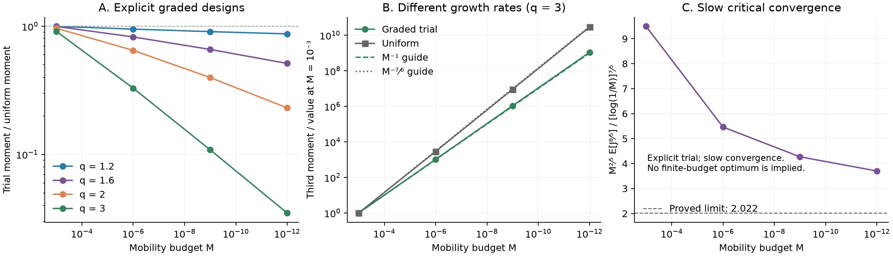

# Designing surface transport with uncertain kinetics: moment thresholds and measurement resolution

**Working-paper draft — 2026-09-07. Internal research document; not submitted or published.**

This companion to [Kinetic defects in adsorbing channels](working-paper-kinetic-defects.md) organizes the completed uncertainty and design results. Independent proof records are linked at each theorem; a [final manuscript scope review](review-working-paper-uncertain-mobility.md) found no outstanding corrections after the connected-wall assumption was made explicit. Mathematical verification and literature novelty are separate judgments. The sharp subcritical and critical coefficients, generic order extension, finite-precision endpoints and finite-bulk transfer have passed independent review.

## Abstract

Limited surface mobility can reduce the dispersion caused by spatially slow adsorption kinetics, but the best placement depends on what is known about the wall and how large responses are penalized. For reversible exchange with constant affinity, equilibrium retention and mean tracer speed remain unchanged as the kinetic pattern varies. We optimize positive moments of a surface inverse response over arbitrary nonnegative mobility fields with a fixed integral. In a bounded random-offset ensemble, spatial design moves the moment transition from order 4/3 to 8/5; the new critical moment includes a logarithmic factor of power 7/5. The same orders hold for smooth one-parameter kinetic families with finitely many transverse folds. Quantized observation of the offset produces a separate resolution-budget law: the optimal mean is comparable to M^(−1/5)+M^(−1/4)Δ^(1/4), with sharp constants in the fine- and coarse-resolution limits. A uniform-background argument transfers optimized scalar values to finite transverse bulk diffusion without changing the budget or observation. The results quantify a particular singular transport problem; they do not introduce risk-aware design or the general value of better information.

## 1. Model and decision variables

A solute moves longitudinally through a fixed channel and exchanges reversibly with its wall. Let Ω be its fixed bounded smooth cross-section, connected and with connected closed boundary Γ of length P; its area is A. The imposed bulk velocity u is in L²(Ω), transverse bulk diffusivity D_b is positive, and surface advection is absent. Bulk and adsorbed concentrations C and ρ obey

\[
 \partial_t C+u\partial_xC=D_b\Delta_yC+D_b^x\partial_x^2C,
 \qquad -D_b\partial_nC=Kk_\omega C-k_\omega\rho,
\]

\[
 \partial_t\rho=\partial_s(D\partial_s\rho)
 +D^x\partial_x^2\rho+Kk_\omega C|_\Gamma-k_\omega\rho.
 \tag{1}
\]

The random rate k_ω is nonnegative. Affinity K>0, with dimensions length, is fixed. The divergence-form surface mobility preserves uniform equilibrium even when D varies. Thus

\[
 Z=A+KP,\qquad V=Z^{-1}\int_\Omega u,\qquad B=KV^2/Z
 \tag{2}
\]

do not depend on the kinetic realization or mobility placement. We assume V≠0 for singular flow-dispersion transfers. This is a dilute linear model, excluding adsorption saturation, moving walls and kinetic feedback on flow.

For fixed nondimensional units, define

\[
 J_k(D)=\sup_{f\in C^\infty(\Gamma)}
 \left\{2\int f-\int[D|f'|^2+kf^2]\right\},
 \qquad D\in L^1,\quad D\ge0,\quad\int D=M.
 \tag{3}
\]

Infinite values are permitted. For positive coefficients this is the integrated solution of `−(Dh′)′+kh=1`. Smooth-test lower bounds cover arbitrary fine structure without assigning a classical diffusion process to every degenerate coefficient. Positive-background designs have a specified closed energy form.

A policy chooses D using an observation Y of the wall. Each observation receives the same budget M; resources are not pooled across realizations. The scalar objective is

\[
 F_q(M;Y)=\inf_{D_Y}\mathbb E[J_{k_\omega}(D_Y)^q],\qquad q>0.
 \tag{4}
\]

These are unrooted moments; taking their qth root leaves the minimizing policies unchanged. Orders above one emphasize large responses. Orders below one are not conventional risk aversion, and (4) is not an exponential risk-sensitive criterion. No mobility cap, fabrication length or observation cost is included.

The transport setting has substantial precedent in [Dill and Brenner](https://doi.org/10.1016/0021-9797(82)90239-9) and [Levesque et al.](https://arxiv.org/abs/1211.5224). Stochastic elliptic design is established, including [Buttazzo and Maestre](https://arxiv.org/pdf/1002.2770), while [Alphonse, Kunštek and Vrdoljak](https://arxiv.org/html/2602.19869v1) treat general risk criteria for positive-conductivity mixtures. Our question concerns a vanishing mobility budget and random kinetic zeros.

## 2. Spatial design changes the disorder-moment threshold

Take a circle of length 2π and the explicit ensemble

\[
 k_c(s)=(c+\cos s)^2,\qquad c\sim\operatorname{Uniform}[-2,2].
 \tag{5}
\]

The rate has two quadratic zeros when |c|<1, a quartic zero when c=±1, and no zero otherwise. The whole rate profile never approaches zero uniformly. That last feature matters: unconstrained Gaussian amplitudes can instead give an infinite expected response at every positive mobility.

For uniform D, the disorder-moment threshold is q=4/3. A single quadratic zero contributes `C_0a^(−3/4)D^(−1/4)`, where a is its curvature coefficient and

\[
 C_0=\frac\pi2\frac{\Gamma(1/4)}{\Gamma(3/4)}
 =4.6474760094\ldots.
\]

As zeros merge, their curvatures vanish; the quartic layer controls high moments. This mechanism and its finite-bulk transfer are proved in [the random-kinetics record](random-kinetic-barriers.md). The oscillator constant is established mathematics, not a new special-function result.

**Theorem 1: predetermined positive-moment design.** Choose one D before observing c and write its optimum as Φ_q(M). Then

\[
 \Phi_q(M)\asymp
 \begin{cases}
 M^{-q/4},&0<q<8/5,\\
 M^{-2/5}[\log(1/M)]^{7/5},&q=8/5,\\
 M^{(2-3q)/7},&q>8/5.
 \end{cases}
 \tag{6}
\]

For 0<q<8/5, the sharp equivalent is `Φ_q(M)∼K_qM^(−q/4)`, where

\[
 \alpha_q=\frac{6q-4}{q+4},\qquad
 K_q=2^{q-3}C_0^q
 \left[2\mathrm B\!\left(\frac{1-\alpha_q}{2},\frac12\right)\right]^{1+q/4}.
 \tag{7}
\]

At q=8/5, the sharp coefficient multiplying the critical scale in (6) is

\[
 K_{8/5}=\frac{(2C_0)^{8/5}}8\left(\frac47\right)^{7/5}.
 \tag{8}
\]

It is approximately 2.02233076397 and has passed [independent critical-coefficient review](review-critical-risk-mobility.md). No sharp supercritical coefficient is claimed. The complete proof and subcritical review links are in [risk-sensitive-mobility.md](risk-sensitive-mobility.md).

For a fixed symmetric shape, the regular-root calculation reduces formally to minimizing

\[
 \int|\sin s|^{1-3q/2}d(s)^{-q/4}ds,\qquad\int d=1.
\]

Hölder allocation predicts `d∝|sin s|^(−α_q)`. Its integrability fails at 8/5. This elementary calculation identifies a candidate transition but does not control budget-dependent spikes or the merging-root layer.

The rigorous lower bound averages a moving smooth bump over root positions at distance r from a fold. If m is the actual mobility mass in that shell, it gives

\[
 \mathbb E[J_c(D)^q;\text{shell}]
 \ge c_q r^{2-5q/4}m^{-q/4},\qquad m\le c r^7.
 \tag{9}
\]

At criticality, logarithmically many disjoint shells compete for the total budget. Minimizing their summed inverse powers gives `[log(1/M)]^(7/5)M^(−2/5)`. Above criticality, a fold-centered bump of radius R=M^(1/7) yields response at least R^(−3) on a parameter set of probability proportional to R². Explicit rounded algebraic profiles provide matching upper bounds and protect regular roots outside the central patches.

The sharp subcritical proof uses a supporting inequality for the inverse test energy. Averaging its derivative cost over moving roots yields a spatially uniform bound; the leading costs cancel, leaving the harmonic constant. This remains valid for unrestricted L¹ competitors. The critical derivation extends the same test to root arcs approaching folds and tracks their logarithmic normalization. Neither argument identifies exact finite-budget optimizers or proves that all order-optimal mass must concentrate.

These distinctions matter for originality. [Buttazzo, Oudet and Velichkov](https://arxiv.org/abs/1506.00141) provide the reinforcement dual; [Newman, Girvan and Farmer](https://arxiv.org/abs/cond-mat/0202330) already show that resource allocation and nonlinear loss alter large-event statistics. [Berry, Keating and Schomerus](https://doi.org/10.1098/rspa.2000.0580) organize moment powers through rare bifurcations. The candidate contribution is the particular transport threshold, critical logarithm and unrestricted operator bounds.

## 3. The threshold follows from generic fold geometry

The order theorem does not require cosine symmetry. Let `k_c(s)=g(s,c)^2`, with g a C⁴ family on a compact wall and compact parameter interval. Require a nonempty finite set of interior points where

\[
 g=g_s=0,\qquad g_{ss}\ne0,\qquad g_c\ne0.
 \tag{10}
\]

All other spatial zeros are simple. In the stated theorem the fold sites and fold parameters are pairwise distinct. The parameter density is bounded above and bounded below in a two-sided neighborhood of each fold. These assumptions exclude higher degeneracies, global amplitude collapse and a fold sampled only from its rootless side.

**Theorem 2: generic orders.** Under these conditions the predetermined optimum has all three orders in (6), with family-dependent positive comparison constants. No generic sharp coefficient is asserted. [The theorem](generic-kinetic-folds.md) and [independent review](review-generic-kinetic-folds.md) give the complete geometric and variational argument.

The parameter-dependent Morse coordinate reduces each fold locally to a squared quadratic unfolding. Root slopes are proportional to r, and a root shell of width r has probability proportional to r². This reproduces (9). An upper design uses distance to the finite set of known fold sites with a rounded power-law grading. Nonnegative grading supplies a background for additional ordinary roots, including roots that remain stationary at another fold's spatial location for unrelated parameter values.

Thus asymmetry and unequal paired-root weights affect constants without changing these orders. The density and transversality conditions are substantive: different sampling near the fold or higher-order zeros can change the powers. This theorem does not characterize arbitrary random fields or unknown fold locations.

## 4. Measurement resolution sets a separate design scale

For the cosine ensemble, predetermined mean design and exact observation give

\[
 \Phi_1(M)\sim18.38606365\,M^{-1/4},\qquad
 \Psi_1(M)\sim22.40462823\,M^{-1/5}.
 \tag{11}
\]

The constants differ because the powers differ. The ratio tends to zero as `1.21857M^(1/20)`, which is slow. Perfect observation changes the budget exponent; it does not promise a large gain at a specified finite budget.

Now observe only the equal-width bin containing c, with Δ=4/N. A policy selects one field per bin, each of mass M. Let Φ(M,Δ) be the optimum expected scalar response. The observation is noiseless quantization, not additive noise or a confidence interval. Refining nested partitions cannot worsen the optimum; arbitrary shifted partitions are not ordered by width alone.

**Theorem 3: resolution-budget law and endpoints.** Uniformly in the relative rates at which M and Δ tend to zero,

\[
 \Phi(M,\Delta)\asymp M^{-1/5}+M^{-1/4}\Delta^{1/4}.
 \tag{12}
\]

If `Δ/M^(1/5)→0`, the sharp coefficient is the adaptive constant in (11). If `Δ→0` and `Δ/M^(1/5)→∞`, then

\[
 \Phi(M,\Delta)\sim K_{\rm coarse}M^{-1/4}\Delta^{1/4},
 \qquad K_{\rm coarse}=2^{-3/4}C_0\mathrm B(1/2,1/8)
 =25.72382739\ldots.
 \tag{13}
\]

Both endpoints and the uniform order bound have [independent review](review-finite-precision-mobility.md). A proposed exact formula at finite nonzero `Δ/M^(1/5)` remains unproved and is not part of this theorem.

The local scale follows from a known quadratic defect of curvature a and allocated mass m. Its optimal mobility patch has width `ℓ=(m/a)^(1/5)`. Offset uncertainty Δ moves a root by approximately `Δ/√a`, giving the local comparison

\[
 \Delta\sim m^{1/5}a^{3/10}.
 \tag{14}
\]

The exponent involves curvature, not slope. Root-averaged dual tests prove the lower bound for arbitrary placements. Padded mobility patches cover uncertain regular roots; a separate quartic patch controls bins crossing a merger. Both singular contributions are integrable over the offset, which is why those bins do not change the global threshold in (12).

With N=2^b bins, adaptive order requires approximately `(1/5)log₂(1/M)` binary digits, up to an additive constant. In the sharp coarse regime an additional digit multiplies the leading response by 2^(−1/4). This is a consequence of the specified quantizer, not a general information-capacity or sensor-optimization theorem. [Yüksel and Linder](https://arxiv.org/pdf/1009.3824) and [Saldi, Yüksel and Linder](https://arxiv.org/pdf/1511.04657) establish observation-channel and quantized-policy frameworks; the present addition is a singular budget-dependent rate.

## 5. Finite bulk mixing preserves optimal values

Let D_flow denote the flow-induced part of D_eff under the convention `Var X(t)∼2D_eff t`. It has the exact finite-response form

\[
 D_{\rm flow}=BJ_k(D)+R(D,k),\qquad R\ge0.
 \tag{15}
\]

For arbitrary competitors, the smooth-test lower bound `D_flow≥BJ` still applies. The inverse identity itself is not used to subtract infinite forms.

**Theorem 4: transfer at unchanged budget and information.** Suppose the fixed connected one-dimensional wall and kinetic ensemble satisfy uniformly `0≤k≤K_0` and `∫k≥κ>0`. Let G_q be the full-bulk counterpart of (4). If the policy class permits mixing with uniform mobility and

\[
 F_q(M;Y)/[1+\log(1/M)]^q\longrightarrow\infty,
\]

then

\[
 G_q(M;Y)\sim B^qF_q(M;Y).
 \tag{16}
\]

The observation law may vary with M. This [independently reviewed transfer](scalar-to-bulk-design-transfer.md) applies to the generic fold orders, the sharp cosine subcritical and critical coefficients, and both finite-precision endpoints. It cannot establish an unknown scalar coefficient or the unproved interior resolution crossover.

The proof adds a vanishing background without changing the budget:

\[
 D^\theta=(1-\theta)D+\theta M/P,
 \qquad J_k(D^\theta)\le J_k(D)/(1-\theta).
\]

A general one-dimensional trace estimate gives `R≤C[1+log(1/min D^θ)]`. Choosing θ=M makes this remainder logarithmic, while all present scalar optima grow polynomially. Moment inequalities then prove (16). No optimizer needs to exist, and no regular-variation assumption is required.

The logarithmic lemma uses positivity of `kH_D^(−1)1`, its fixed integral, and an H^(−1/2) Fourier estimate. It does not require bounds on derivatives of D. The result concerns optimal values, not the remainder of every unmixed design or convergence of optimizing profiles. It is not uniform as D_b→0, fails to give the singular conclusion at V=0, and requires a new argument for higher-dimensional surfaces. Fixed molecular diffusion and the isotropic surface term KM/Z are lower order here.

## 6. Verification and interpretation

**Figure 1.** Explicit graded trials compared with uniform mobility; different third-moment growth; and slow critical convergence. The curves are admissible designs, not certified finite-budget optima. Numerical curves alone do not establish sharp asymptotic constants. [Exportable PDF](../results/risk-sensitive-design.pdf).

At M=10⁻¹² and q=3, the tested graded moment is about 3.49% of the uniform value. Refining both the wall grid and offset quadrature changes that ratio only slightly. At criticality the corresponding ratio is about 0.513, but the normalized moment is still changing appreciably. The [numerical record](numerical-verification.md) and [data](../results/risk-sensitive-design-checks.json) preserve this distinction between convergence checks and variational certification.

For the mean, the asymptotically best predetermined shape is 3.36% worse than uniform at M=10⁻³, nearly equal at M=10⁻⁶, and 2.09% better at M=10⁻⁹, compared with an eventual improvement of 4.7%. The true predetermined optimum cannot be worse than uniform. These finite-budget comparisons qualify the practical reading of the asymptotic powers. A separate finite-dimensional optimization of the unit-curvature, unit-budget local uncertain-center problem gives responses about 6.22265, 6.63310 and 11.13858 at scaled uncertainties 0, 2 and 32 on a 400-cell grid. These are discrete optimization checks; they neither prove a continuum optimizer nor establish the unproved intermediate global crossover. The finite-precision theorem rests on reviewed analytic estimates.

The theory separates equilibrium measurements from kinetic information: identical retention can conceal different spreading, and measuring a rate pattern can alter how effectively mobility is used. It does not show that mobility, affinity and exchange barriers can be varied independently in a real coating. Shrinking patch sizes must remain within the validity of a continuum model. Bounds on mobility, spatial resolution or measurement cost would define different admissible problems.

The [risk-design](risk-sensitive-prior-art.md) and [measurement-resolution](finite-precision-mobility-prior-art.md) audits found no matching transport theorem in the inspected primary sources, while identifying substantial prior art for the decision and variational methods. A submission would need full-text comparison with remaining older transport sources and a clear account of finite-parameter validity. The current record supports specific model theorems and their limits, rather than a claim of guaranteed publication, experimental feasibility or universal benefits from risk-aware design.
